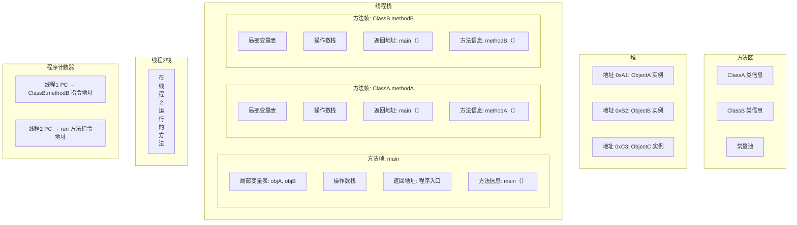

# Java基础内容

‍

### java在jvm中运行时的内存图

‍

- 方法区：存放类结构（类名、字段、方法、访问修饰符等）、静态变量（包括引用地址）、常量池（字符串字面量、符号引用等）

  > 方法区是JVM中所有线程共享的内存区域。
  >
  > 字符串创建时是静态且没有new对象，就说明是字面量，存放到常量池中
  >
  > 静态变量如果引用对象，确实存储引用地址，实际对象在堆中。
  >
- 堆：对象实例（字段值，对象头）

  > 方法本身是代码，存储在方法区，而方法执行时的对象（new 方法）实例在堆中。
  >
- 栈：**栈帧**（包含局部变量表、操作数栈、返回地址等）、局部变量、对象引用

  > **每个线程都有自己的栈**，而**每个方法调用会在该线程的栈中创建一个栈帧（Stack Frame）**
  >
  > 后进先出的规则
  >
- **程序计数器**：当前执行指令地址（字节码地址）

  > 程序计数器是每个线程私有的，用于存储当前执行指令的地址（即下一条要执行的字节码指令的地址）。
  >
  > 它存储的是指令地址，而不是“字符串地址”。字符串地址可能误解了——字符串数据存储在堆或常量池中，但程序计数器指向的是代码指令。
  >

‍

### HashMap

存储方式，当用户存入k/v时，先通过hashcode 计算对应key的hash，然后计算桶索引（桶的内存地址时连续的，存在于堆中），定位到桶的位置。同一个索引（hash冲突）中的元素使用链表或者红黑树连接（桶中的节点是通过链表或者红黑树连接的不是连续的）。

- 当链表长度超过8且桶数组长度达到64时，链表会转换为红黑树；当树节点数小于6时，会退化为链表。

> 如图

‍
